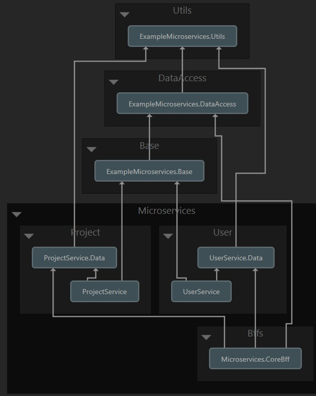

# dotnet-microservices
Dotnet core microservices with dotnet-crud-repository repository and bff layers
now implemented graphql!

# Dependency diagram:

# Startup
Set this environment parameters on your database server setting.

`MYSQL_IP`
`MYSQL_PORT`
`MYSQL_USER`
`MYSQL_PASWORD`
`MYSQL_DB`

complate this step by example data on powershell

`$env:MYSQL_IP  = 'localhost'`

`$env:MYSQL_PORT  = 3306`

`$env:MYSQL_USER  = 'root'`

`$env:MYSQL_PASWORD  = 'root'`

`$env:MYSQL_DB = '<MICROSERVICE_DATABASE_NAME>'`

And use default all migrations to your database server.

PM> `Update-Database -StartupProject <MICROSERVICE_DATA_PROJECT>`

Than database migrations applied, you can use demo api endpoints.

for example send to : 

# graphql 
you can use this project graphiql screen.

`http://localhost:8020/graphql`

And body
`{
  project(id:1) {
  id,
  title,
  roles {
    userName
    id
  }
} }`

# enjoy!
